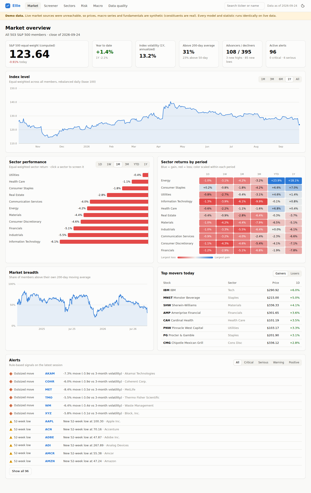
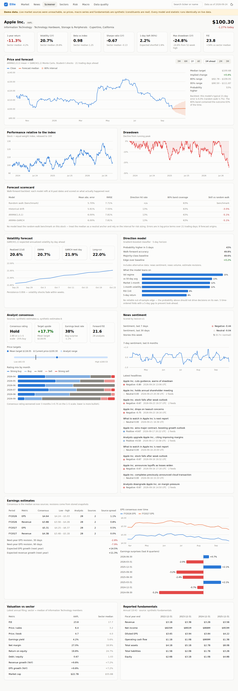
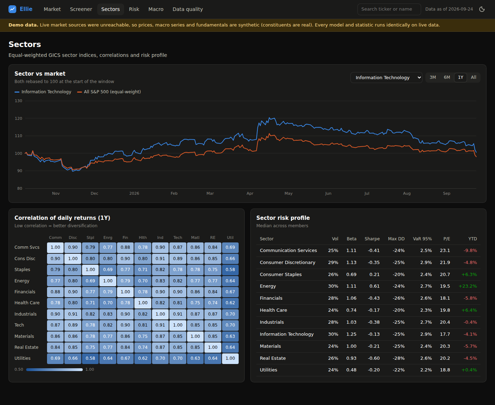
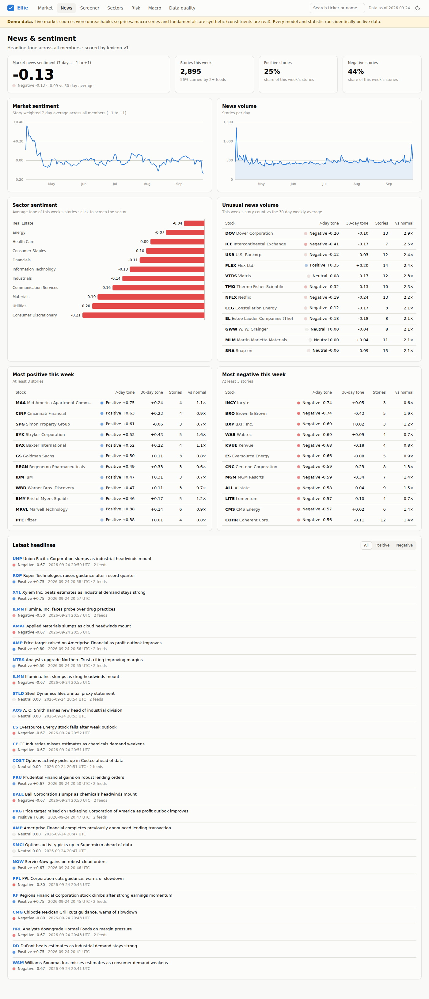

# Ellie — S&P 500 Equity Intelligence Platform

Ellie monitors every S&P 500 member using several pulled data sources, reconciles them
into one trusted warehouse, and turns that data into statistics, risk metrics and
forecast models shown in a web dashboard.

| Dashboard | What it answers |
|---|---|
| **Market** | Where is the index today? Which sectors lead or lag? How broad is the move? What needs attention (alerts)? |
| **News** | Market and sector news sentiment, unusual news volume, most positive / negative names, a scored headline feed |
| **Screener** | Rank and filter all ~500 names on returns, risk and valuation, or switch to analysts & news (forward P/E, estimate revisions, rating, target upside, beat rate, sentiment); export to CSV |
| **Stock detail** | Price with a forward forecast cone, relative performance, drawdown, forecast scorecard, volatility forecast, direction model, analyst consensus and price targets, earnings estimates and surprises, news sentiment and headlines, valuation vs sector, reported fundamentals |
| **Sectors** | Sector vs market, cross-sector correlation (diversification), sector risk profile |
| **Risk** | Risk vs return map of every member, largest tail risk (VaR / expected shortfall), deepest drawdowns |
| **Macro** | Rates, curve, VIX, inflation, unemployment, fed funds, credit spreads |
| **Data quality** | Source health, cross-source reconciliation issues, ingestion history, one-click refresh |

The executive plan this implements is in [`docs/PLAN.md`](docs/PLAN.md).



| Stock detail with forecast | Sectors (dark theme) |
|---|---|
|  |  |



## Quick start

```bash
pip install -r requirements.txt
python -m ellie ingest          # pull all sources, validate, reconcile, load the warehouse (~1–15 min live)
python -m ellie serve           # http://127.0.0.1:8000
```

Or with Docker:

```bash
docker build -t ellie . && docker run -p 8000:8000 -v ellie-data:/data ellie
```

Other commands:

```bash
python -m ellie ingest --mode synthetic         # offline demo data (runs in ~10s)
python -m ellie ingest --limit 50               # first 50 members only, for a quick test
python -m ellie forecast MSFT --horizon 21      # forecast + model scorecard in the terminal
pytest -q                                       # test suite
```

### Live vs demo data

`--mode auto` (the default) probes the live price sources first. If none respond (a
firewall, a network policy, a vendor outage) it falls back to a **deterministic
synthetic dataset**, and the dashboard shows a "Demo data" banner. Constituents are
always the real S&P 500 list. Demo and live data are never mixed: switching modes
clears the warehouse first. `--mode live` fails loudly instead of falling back.

## Architecture

```
Sources ─► Ingestion (parallel, retrying) ─► prices_raw (one row per source)
                                                │
                           validation checks ◄──┤
                           reconciliation ◄─────┘
                                │
                  curated warehouse (prices, macro, fundamentals, constituents)
                                │
            analytics: statistics · risk · valuation · forecasting (+ backtests)
                                │
                     FastAPI REST API ─► web dashboard (vanilla JS + SVG)
```

| Layer | Module | Notes |
|---|---|---|
| Sources | `ellie/sources/` | One module per vendor, all behind the same small interface |
| Pipeline | `ellie/ingest.py` | Incremental re-pulls with a 10-day overlap; per-symbol failures are recorded but never sink a run |
| Quality | `ellie/quality.py` | Impossible prices dropped; extreme moves flagged; cross-source spreads above 0.5% flagged; coverage gaps reported |
| Warehouse | `ellie/db.py` | SQLite for the MVP; the schema maps directly onto Snowflake / Databricks for scale-out |
| Analytics | `ellie/analytics/` | `stats.py` (returns, risk, breadth, alerts), `valuation.py`, `forecast.py` |
| Service / API | `ellie/service.py`, `ellie/api.py` | Analytics cached per ingestion run; forecasts cached per symbol |
| Dashboard | `ellie/web/` | No build step; light and dark themes; works on mobile |

### Data sources

| Dataset | Primary | Secondary / fallback |
|---|---|---|
| Index membership | `datasets/s-and-p-500-companies` (GitHub) | Bundled copy in `data/` |
| Daily prices | Yahoo Finance chart API (split/dividend-adjusted) | Stooq CSV (used for cross-checking) |
| Macro | FRED (10y, 3m, 10y-2y, VIX, CPI, unemployment, fed funds, HY spread) | FRED API if `ELLIE_FRED_API_KEY` is set |
| Fundamentals | SEC EDGAR XBRL company facts (10-K) | — |
| News | Yahoo Finance RSS headlines (no key) | Finnhub company news (`ELLIE_FINNHUB_API_KEY`) |
| Analyst estimates, ratings, price targets, earnings surprises | Finnhub (`ELLIE_FINNHUB_API_KEY`) | Financial Modeling Prep estimates and targets (`ELLIE_FMP_API_KEY`) |

When two price sources report the same day, the curated close comes from the
higher-priority source, and any spread above tolerance becomes a reconciliation issue.
With three or more sources the median wins. Add a licensed vendor (Polygon, Databento,
Bloomberg, FactSet) by adding a module with a `fetch_symbol` function and registering
it in `ingest.PRICE_SOURCES` and `quality.SOURCE_PRIORITY`.

News from different feeds is **de-duplicated**: the same headline for the same stock on
the same UTC day is stored once, with every feed that carried it. Only stories that are
new to the warehouse are scored, so re-runs don't pay to re-score. Analyst data is stored as **daily
snapshots per source**. Consensus is the median across sources, estimate revisions come
from snapshot history, and sources that disagree by more than 10% raise a data-quality
issue. The free Finnhub tier allows 60 calls/minute, so a full analyst refresh of 500
names (five endpoints each) takes about 45 minutes; some Finnhub endpoints (estimates, targets) need a paid plan
and are skipped cleanly if the key doesn't cover them.

### News sentiment scoring

| Scorer | How | When to use |
|---|---|---|
| `lexicon` (default) | Finance-specific word and phrase lists in the spirit of Loughran-McDonald, with negation handling | Free, instant, deterministic; good at formulaic headlines |
| `claude` | A Claude model scores each headline from the named company's shareholders' point of view, 40 headlines per request, using structured JSON output | Better on nuance (e.g. "shares rise despite guidance cut"); costs API usage |

Set `ELLIE_SENTIMENT_SCORER=claude` (with Anthropic credentials, e.g. `ANTHROPIC_API_KEY`)
to switch. The model defaults to `claude-opus-5` and can be changed with
`ELLIE_SENTIMENT_MODEL`. Requests use Anthropic's server-side fallback, so a policy
decline is retried on the recommended fallback model. A batch that still fails, or comes
back incomplete, is scored by the lexicon instead, so an ingestion run never fails
because of scoring. Each story records which scorer produced its score.

### Models

| Model | Purpose | How it is kept honest |
|---|---|---|
| ARIMA(1,0,1) on log returns, shrunk toward zero | Price path median | Walk-forward backtest against a random walk and a historical-drift benchmark |
| GARCH(1,1) by maximum likelihood, Monte Carlo with Student-t shocks | Forecast intervals, volatility term structure | 80% interval coverage is reported per stock |
| EWMA (RiskMetrics, λ = 0.94) | Current volatility | Compared against realized and GARCH volatility side by side |
| Gradient-boosted classifier on technical, market and alternative-data features (7-day news sentiment, news volume, 30-day EPS revision) | 5-day direction probability | Time-ordered cross-validation with a gap to prevent look-ahead; alternative data uses only what was published by each day; accuracy shown against a majority-class baseline |
| Analyst consensus: median across sources, revisions from snapshots, 1–5 rating score, target upside, beat rate | Analyst view per stock; alerts on ±5% 30-day estimate changes | Cross-source spread shown next to every consensus figure |
| News sentiment: story-weighted 7- and 30-day tone, volume vs normal | Market, sector and stock sentiment; alerts on unusual volume with strongly positive or negative tone | Scorer recorded on every story |
| Historical and parametric VaR, expected shortfall, beta, Sharpe, drawdown | Risk statistics | Computed over the last 252 sessions |

Every forecast ships with its error band and its out-of-sample record. If no model beat
the random-walk benchmark for a stock, the dashboard says so.

## Configuration

| Variable | Default | Purpose |
|---|---|---|
| `ELLIE_DB_PATH` | `data/ellie.db` | Warehouse location |
| `ELLIE_DATA_MODE` | `auto` | `auto`, `live` or `synthetic` |
| `ELLIE_HISTORY_DAYS` | `1095` | Calendar days of history on first load |
| `ELLIE_SEC_USER_AGENT` | placeholder | **Set this** to `"Your Org contact@yourorg.com"`, as SEC EDGAR fair-access rules require |
| `ELLIE_FRED_API_KEY` | — | Optional FRED API key |
| `ELLIE_MAX_WORKERS` | `8` | Parallel requests per source |
| `ELLIE_RECONCILE_TOLERANCE` | `0.005` | Cross-source close spread that raises an issue |
| `ELLIE_FINNHUB_API_KEY` | — | Enables Finnhub news and analyst data |
| `ELLIE_FMP_API_KEY` | — | Enables Financial Modeling Prep estimates and price targets |
| `ELLIE_SENTIMENT_SCORER` | `lexicon` | `lexicon` or `claude` |
| `ELLIE_SENTIMENT_MODEL` | `claude-opus-5` | Claude model used when the scorer is `claude` |
| `ELLIE_NEWS_DAYS` | `30` | Days of news pulled on each live run |
| `ELLIE_ESTIMATE_TOLERANCE` | `0.1` | Cross-source consensus spread that raises an issue |
| `ELLIE_ADMIN_TOKEN` | — | If set, `POST /api/ingest` requires the `X-Admin-Token` header |

Schedule `python -m ellie ingest` after the US close (for example, cron `30 22 * * 1-5` UTC).
Runs are incremental after the first load.

## API

`GET /api/status · /api/overview · /api/screener · /api/stocks/{symbol} ·
/api/stocks/{symbol}/forecast?horizon=21 · /api/stocks/{symbol}/news · /api/stocks/{symbol}/estimates ·
/api/sentiment · /api/sectors · /api/risk · /api/macro ·
/api/alerts · /api/quality` and `POST /api/ingest?mode=auto`. Interactive docs are
served at `/docs`.

## Known limits of this MVP

- The index is **equal-weighted** and computed from members. A licensed S&P DJI feed
  would add the official cap-weighted level and point-in-time membership, which
  removes survivorship bias from backtests.
- Yahoo and Stooq are free, unofficial endpoints suited to research. Production use
  needs a licensed price vendor. Check redistribution terms before sharing dashboards
  externally.
- Free news feeds carry headlines, not full articles, so sentiment is headline-level.
  A licensed feed (RavenPack, Benzinga) would add full text and entity tagging.
- Estimates are annual (fiscal-year) consensus. Quarterly estimates need a paid plan
  from either vendor.
- Revisions need history: in live mode, 30- and 90-day revisions appear once the
  pipeline has been storing snapshots for that long.
